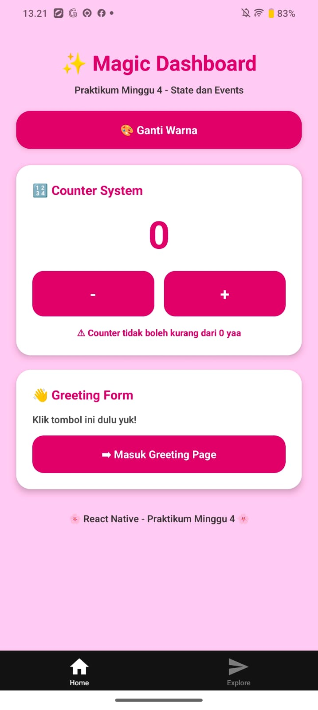
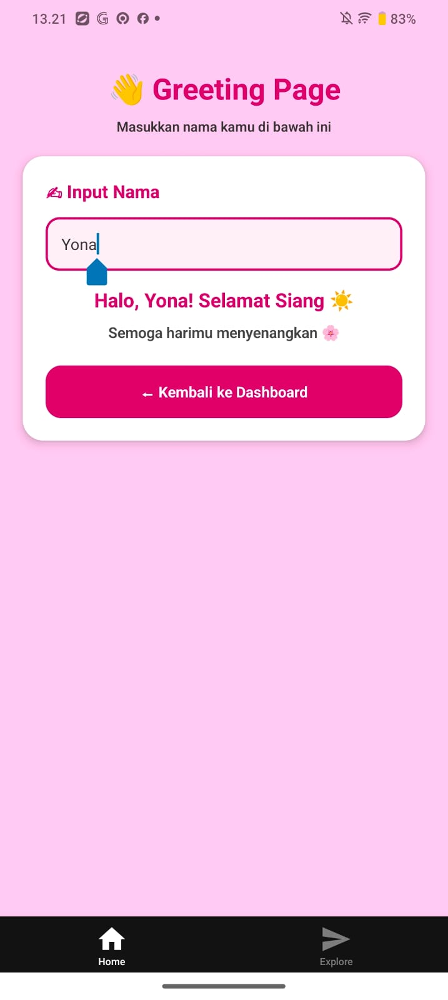

# Project M4: Interaction Master ⚡
Tugas praktikum Minggu 4 - State & Events.

## 📸 Preview

### Tampilan Home

### Tampilan Greeting Page

## 🛠️ Logic Implemented
- **useState Hook:** Managing name and role input.
- **Event Handlers:** onChangeText for real-time binding.
- **Reset Logic:** Clearing all states with one tap.

## 🔗 Demo
[Cek di Expo Snack](link_snack_anda)
